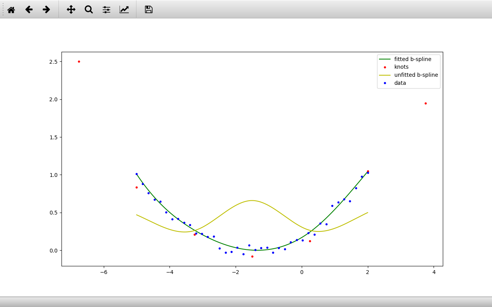

# tf-bspline
A TensorFlow implementation of a b-spline interpolator. This is done so that TensorFlow can
follow the operations (i.e. for use in calculating derivatives). This utilizes the 
cardinal b-spline interpolation from tensorflow-graphics, however, only select files
are taken from that package because it takes a very long time to import. Be aware that updates to 
tensorflow-graphics will need to be manually incorporated in tf-bspline.

This package will not exceed the speed of scipy's interpolation operations and is in fact
much slower.
## BSpline()
```python
BSpline(self, start_position, end_position, num_internal_knots, degree)
```
Constructor.

Creates a Tensorflow-based b-spline object for use with x,y coordinate data.

```start_position```-> start x-value of the bspline.

```end_position```-> end x-value of the bspline.

```num_internal_knots```-> minimum number of knots that will be placed in b-spline range (more will actually be
                           used in total, including those outside of specified range). Actual knots used may be
                           obtained from get_knots().
                           
```degree```-> degree of the b-spline

### set_knot_values
```python
BSpline.set_knot_values(self, knot_y_values)
```

Manually set the knot y-values.

``` knot_y_values```-> new y-values. Must include exactly the same number of values as number of knots
                       given by get_knots().

### get_knots
```python
BSpline.get_knots(self)
```

```Returns```-> current knot positions and values.

### fit_points
```python
BSpline.fit_points(self, x, y)
```

Fits b-spline to given x, y data by adjusting internal knot y-values

```x```-> x values

```y```-> y values

## BSpline()
```python
BSpline(positions=None, raster=None):
```
Returns the calculated b-spline points. MUST SPECIFY ONLY POSITIONS OR RASTER, NOT BOTH

```positions```-> specific x-values to return values for.

```raster```-> division length to divide full b-spline range by.

```Returns```-> b-spline points with shape=(2, num_points).
 i.e. (\[x], \[y])

# Example
Here is an example test script with output.
```python
from tfbspline import BSpline
import numpy as np
import matplotlib.pyplot as plt

# Create junk data calculated with y = x^2 + noise
start = -5
end = 2
data_x = np.linspace(start, end, 40)
noise = np.random.normal(0, 0.05, 40)
data_y = np.square(np.linspace(-1, 1, 40)) + noise

# create b-spline
spline = BSpline(start, end, num_internal_knots=3, degree=3)
# store original knots to plot later
original_knots = spline.get_knots()

# fit spline to data
spline.fit_points(data_x, data_y)

# get fitted knots
fitted_knots = spline.get_knots()

# plot fitted spline
spline_points = spline(raster=0.001)
plt.plot(spline_points[:, 0], spline_points[:, 1], 'g')

# plot knots
plt.plot(fitted_knots[0], fitted_knots[1], 'r.')

# plot original spline
spline.set_knot_values(original_knots[1])
spline_points = spline(raster=0.001)
plt.plot(spline_points[:, 0], spline_points[:, 1], 'y')

# plot data
plt.plot(data_x, data_y, 'b.')

# add legend
plt.legend(['fitted b-spline', 'knots', 'unfitted b-spline', 'data'], loc='best')
plt.show()
```
<p align="center">
  
</p>
